<!-- Created by Cesar Herrera -->

<!-- Display Twitter and GitHub accounts icons and links -->

[![alt text][1.2]][1]
[![alt text][2.2]][2]

<!-- links to social media icons -->

<!-- icons with padding -->

[1.1]: images/icons/twitterico.png (icon with padding)
[2.1]: images/icons/githubicon.png (icon with padding)

<!-- icons without padding -->

[1.2]: images/icons/twittericon2.png (icon without padding)
[2.2]: images/icons/githubicon2.png (github icon without padding)

<!-- links to accounts -->

[1]: http://www.twitter.com/CexyNature
[2]: http://www.github.com/CexyNature

<!-- End -->
A repository containing information for people affected or people wanted to support those affected during Townsville floods 2019
===============

The purpose of this repository is to compile and curate useful information for people requiring financial aid, counselling support, or for people interested in donating their time, money and/or services to the communities affected. 
**This is not an official information channel**, but I will do my best to only include official information. 
If you would like to include information please follow instructions at the bottom.

# List of content:

- [Emergency information and contact numbers](#Emergency-information-and-contact-numbers)
- [Financial assitance and aid](#Financial-assistance-and-aid)
- [Counselling support](#Counselling-support)
- [Official donation channels](#Official-donation-channels)
- [Other types of support](#Other-types-of-support)
- [Information about how to deal with natural disasters](#Information-about-how-to-deal-with-natural-disasters)
- [Local Announcements](#Local-Announcements)
---
- [How to collaborate or add information in this repo](#How-to-collaborate-or-add-information-in-this-repo)

## Emergency information and contact numbers

- Australia wide primary emergency number (police, ambulance, fire, fallen powerlines):

Phone: **000** (*from mobile phones people can also use number* **112**)

- [Townsville emergency dashboard](http://disaster.townsville.qld.gov.au)

Phone: **13 48 10**

This website provides updated information about: emergency news, weather warnings, road conditions, power outages and more.

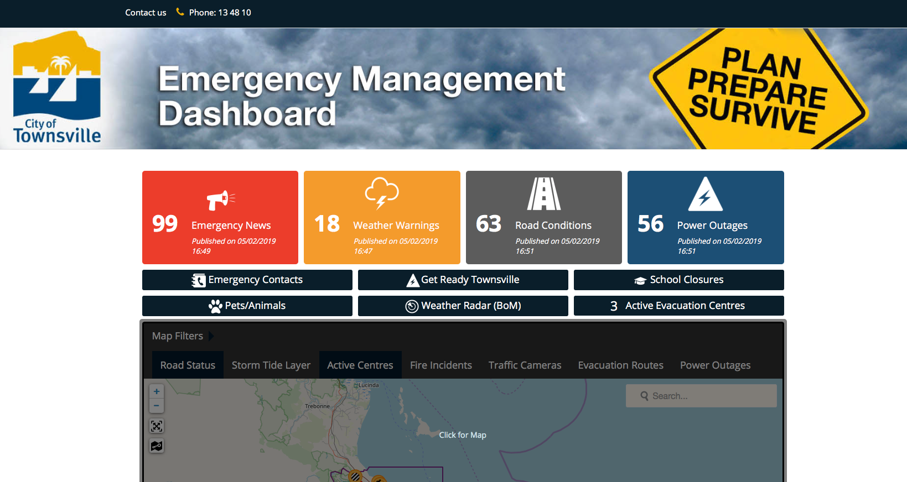

- Townsville Local Disaster Management Group

Phone: **1800 738 541**

- Ergon Energy

Phone: **13 16 70**

- North Regional Gas

Phone: **(07) 4774 5111**

- [Queensland road, hazard and traffic conditions state wise](https://qldtraffic.qld.gov.au)

- Other emergency numbers can be consulted in [Townsville City Council Emergency Contacts website](https://www.townsville.qld.gov.au/community-support/community-safety/disaster-management/during-a-disaster/emergency-contacts) and their official twitter account 

## Financial assistance and aid

- Queensland Government

Financial assistance has been extended to all flood-affected people in Townsville as per communication of Queensland Acting Minister for Disability Services and Seniors The Honourable Shannon Fentiman ([press release](http://statements.cabinet.qld.gov.au/Statement/2019/2/4/financial-assistance-extended-to-all-floodaffected-people-in-townsville))

Community recovery hotline phone: **1800 173 349**

Information for applying to grants can be found at the **[Community Recovery Queensland](https://www.communityrecovery.qld.gov.au/#/)** website, and you can apply for these grants using their app ([as indicated in their website](https://www.qld.gov.au/community/disasters-emergencies/recovery-after-disaster/self-recovery-app), [Apple app](https://itunes.apple.com/au/app/selfrecovery/id942944983?mt=8), and [Android app](https://play.google.com/store/apps/details?id=communities.gov.au.disasterrecoverydroid&hl=en). *Please observe links to official apps are offered here for reference, please always use links from official [website](https://www.qld.gov.au/community/disasters-emergencies/recovery-after-disaster/self-recovery-app)*) 

Information about type of grants, eligibility and region/areas included can be found in the [North and Far North Queensland Monsoonal trough - 25 January to 2 February 2019 website](https://www.qld.gov.au/community/disasters-emergencies/queensland-disasters/fnq-monsoonal-trough) by the Queensland Government.

Scheme Name | Is this scheme asset tested? | Amount ($) | Does have eligibility criteria? | Website
:--- | :---:| :---: | :---: | :---
Emergency hardship assistance | No | 180 per person (up to 900 for a family) | - | Yes, [link](https://www.qld.gov.au/community/disasters-emergencies/financial-assistance/immediate-hardship-assistance)
Essential household contents grant | Yes, income test | 1765 per single adult (up to 5300 for couples or families) | Yes | Yes, [link](https://www.qld.gov.au/community/disasters-emergencies/financial-assistance/essential-household-content-grant)
Structural assistance grant | Yes, income test | up to 10995 per single adult (up to 14685 for couples or families) | Yes | Yes, [link](https://www.qld.gov.au/community/disasters-emergencies/financial-assistance/structural-assistance-grant)
Essential services safety and reconnection grant | Yes, income test | Inspection up to 200. Repair up to 4200 | Yes | Yes, [link](https://www.qld.gov.au/community/disasters-emergencies/financial-assistance/essential-services-safety-reconnection-grant)

- Federal Government

***Update***: As per [message](https://twitter.com/ScottMorrisonMP/status/1092913249639575553) of PM Scott Morrison the Disaster relief scheme eligibility has been changed which makes easier to people affected by the flooding to successfully request this scheme. [Source](https://www.townsvillebulletin.com.au/news/mixed-messages-about-disaster-relief-payments-spark-worry-among-flood-victims/news-story/10c272adf88264fbe2d58b5586fb8530)

The Australian Government through the Department of Human Services provides help for people adversely affected by the Far and North Queensland floods (February 2019). Four schemes are available:

Scheme Name | Local government areas | Deadline | Amount ($) | Does have eligibility criteria? | Website
:--- | :---:| :---: | :---: | :--- | :---
Australian Government Disaster Recovery Payment | Burdekin, Cook, Douglas, Townsville and Wujal Wujal | August 3rd 2019 | 1000 per adult, and 400 for each child under 16 years of age (one-off payment) | **UPDATE** Yes, but these have been relaxed | Yes, [link](https://www.humanservices.gov.au/individuals/services/centrelink/far-north-queensland-floods-february-2019-australian-government-disaster-recovery-payment)
Ex-gratia Disaster Recovery Payment | as per scheme above but for New Zealand citizens holding a non-protected SCV (subclass 444) and non-residents 
Disaster Recovery Allowance | Burdekin, Cook, Douglas, Townsville and Wujal Wujal | August 3rd 2019 | variable determined by your age and income (among 576.17 and 1591.75 for a maximun of 13 weeks) | Yes | Yes, [link](https://www.humanservices.gov.au/individuals/services/centrelink/far-north-queensland-floods-february-2019-disaster-recovery-allowance)
Ex-gratia Disaster Recovery Allowance | as per scheme above but for New Zealand citizens holding a non-protected SCV (subclass 444) and non-residents

Early on February 5th 2019 was reported (e.g. Power100 news [article](https://www.power100.com.au/news/local-news/150270-commonwealth-government-townsville-disaster-assistance), Townsville bulletin [article](https://www.townsvillebulletin.com.au/news/townsville/1000-disaster-relief-payment-available-to-every-townsville-flood-victim-from-tuesday/news-story/a715597c5462031f43f3d8d0ab37664b)) that the Commonwealth Government had activated a Disaster Recovery Payment for people affected by the flooding. <s>However, the [official link](https://www.disasterassist.gov.au/Documents/Fact-sheets/Disaster-Recovery-Payment-Factsheet.pdf) to this information is not working (producing a *401 UNAUTHORIZED* error) as per *05_FEB_2019_18:03*.</s>
Please see below a cached image of this document for reference:

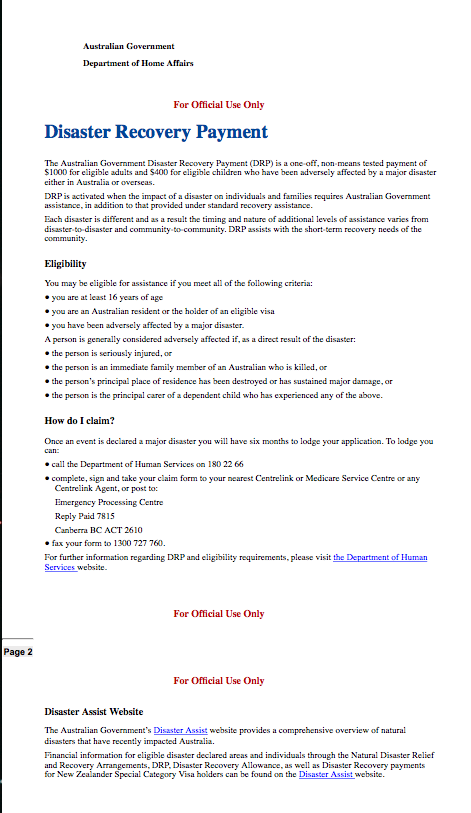

Extracted piece of Townsville Bulletin [report](https://www.townsvillebulletin.com.au/news/townsville/1000-disaster-relief-payment-available-to-every-townsville-flood-victim-from-tuesday/news-story/a715597c5462031f43f3d8d0ab37664b)

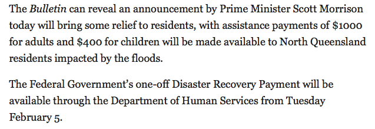

- Financial assistance options for people affected by floods: [Source](https://www.star1063.com.au/big-wet-recovery/big-wet-recovery/136902-a-number-of-financial-assistance-options-are-available-to-those-affected-by-the-floods) local station **Star1063**.

[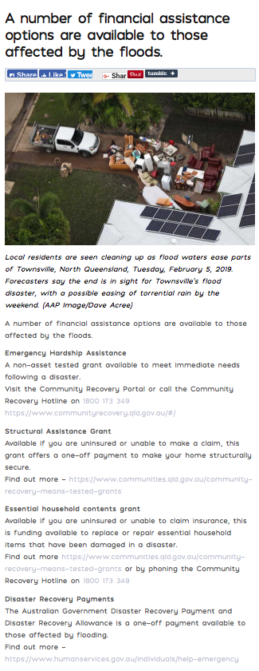](https://www.star1063.com.au/big-wet-recovery/big-wet-recovery/136902-a-number-of-financial-assistance-options-are-available-to-those-affected-by-the-floods) 

## Counselling support

- [Townsville Suicide Prevention Network (TSPN)](http://tspn.org.au)

Phone: **07 4725 3664**

Email: **tspn@selectability.com.au**

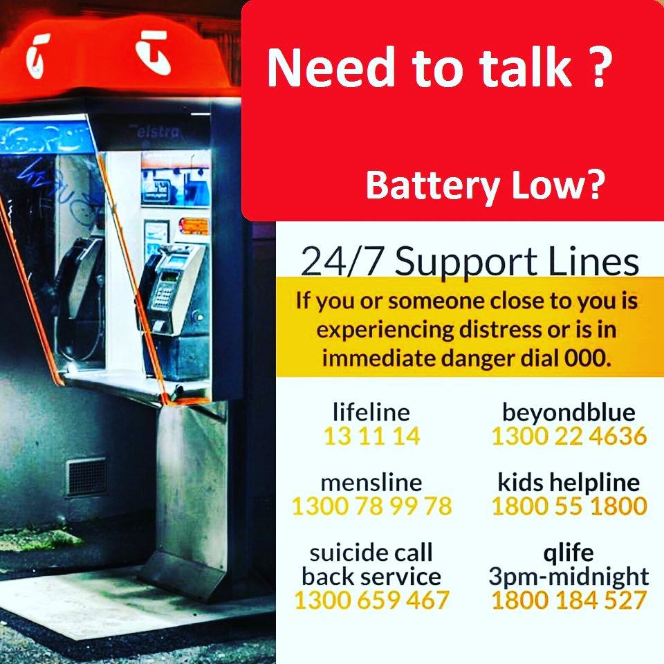

Information above was shared by TSPN as a [message](https://twitter.com/TownsvilleSPN/status/1092304820889739264) on twitter

- [Deparment of Veteran's Affairs](http://www.dva.gov.au)

Phone: **1800 011 046** (24/7)

[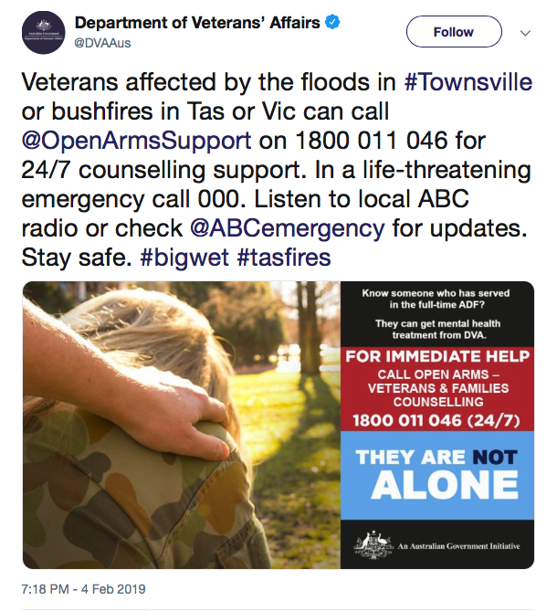](https://twitter.com/DVAAus/status/1092623444598910976)

## Official donation channels

- [givit.org.au](http://givit.org.au/disasters)

Check updates and special requests in their official [twitter account ](https://twitter.com/GIVIT_AUS)

- [GIVIT urgent requests for Townsville](https://twitter.com/GIVIT_AUS/status/1092621115678212097)

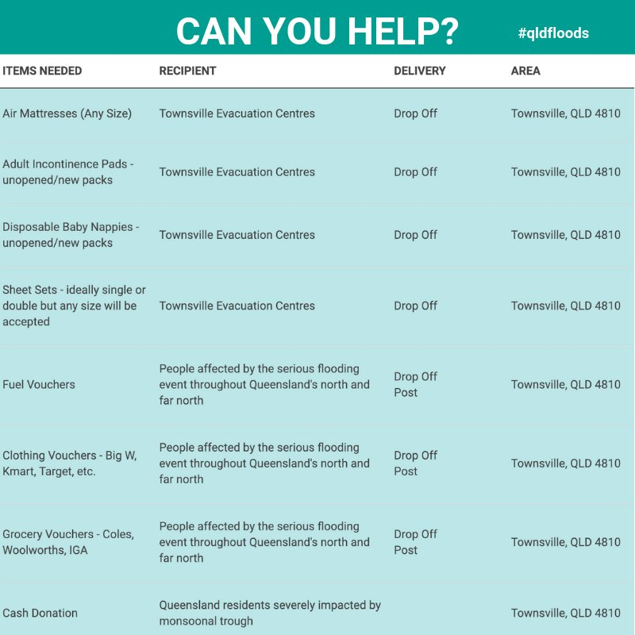

- [Australian Red Cross](https://www.redcross.org.au/disasters)

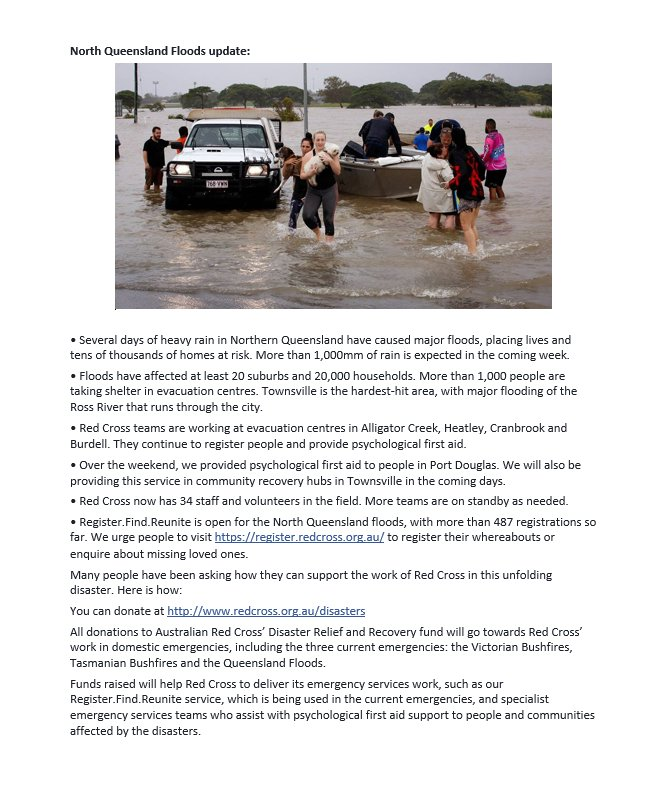

Check updates and special request in their official [twitter account](https://twitter.com/RedCrossAU?lang=en)

- [Good2Give](https://good2give.ngo): Good2Give's Workplace Giving platform. Donate [here](https://good2give.ngo/sign-in/?utm_medium=Social&utm_source=Twitter&utm_campaign=TownsvilleFlood)

[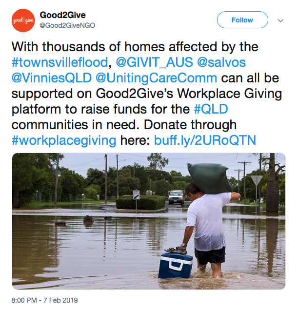](https://twitter.com/Good2GiveNGO/status/1093721188273139712)

- Volunteering:

Please observe the correct link to register is [this one](https://register.emergencyvolunteering.com.au) as per message [here](https://twitter.com/edukasol/status/1093774038311219200)
[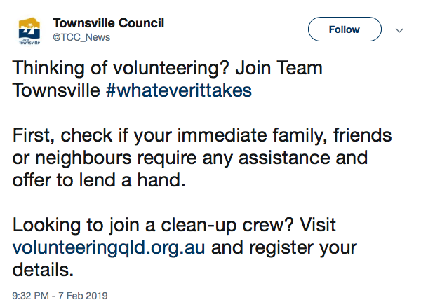](https://twitter.com/TCC_News/status/1093744430673084416)

## Other types of support

- [Indigenous Business Australia](http://www.iba.gov.au)

Hotline phone: **1800 064 800**

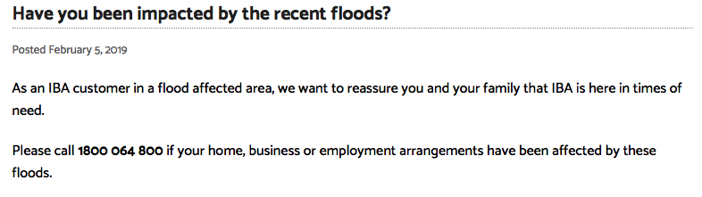

"Indigenous Business Australia (IBA), the former Aboriginal and Torres Strait Islander Commercial Development Corporation (CDC) is an Australian Government statutory authority set up to assist and enhance Aboriginal and Torres Strait Islander self-management and economic self-sufficiency." Taken from Australian Government [webiste](https://www.australia.gov.au/directories/australia/iba) 

## Information about how to deal with natural disasters

 - [Natural disaster fact sheet by Residential Tenancy Authority (RTA)](https://www.rta.qld.gov.au/Forms-and-publications/Fact-sheets/General-tenancy-fact-sheets/Natural-disasters-fact-sheet)
 
 Information, advice and regulations about rental properties that become unliveable after a natural disaster.
 A copy of the QLD RTA fact sheet can be find in this [repo](documents/rta-fact-sheet_important-renting-information-for-natural-disaster-victims.pdf)
 
 - [Register. Find. Reunite by Australian Red Cross](https://register.redcross.org.au)
 Reporting you are safe / Looking for family and friends
 
 - [Flood Clean-up Tips](https://www.facebook.com/ABCnorthqld/photos/a.337209008308/10156063108573309/?type=3) by ABC North Queensland
 
 [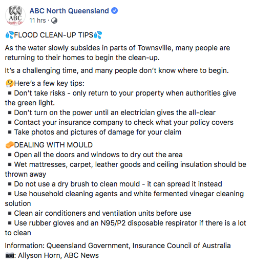](https://www.facebook.com/ABCnorthqld/photos/a.337209008308/10156063108573309/?type=3)
 
 [Source](https://www.facebook.com/ABCnorthqld/photos/a.337209008308/10156063108573309/?type=3)
 
 - Local radio stations provide important information in the event of a emergency. Townsville's local stations are:
 
 Station name |  Frequency
 --- | ---
 ABC Local radio | AM 630  kHz
 Power 100 | FM 100.7 MHz
 Star | FM 106.3 MHz
 Live FM | FM 99.9 MHz
 Triple T | FM 103.9 MHz
 4K1G | FM 107.1 MHz
 Hit FM | FM 103.1 MHz
 Triple M | FM 102.3 FM
 
 - Advice - Rebuilding after a natural disaster by [Queensland Building and Construction Comission](https://www.qbcc.qld.gov.au/home-maintenance/rebuilding-after-natural-disaster)
 
 General and technical advice and information for a wide range of rebuilding issues. Please click image below to visit the official website.
 
 [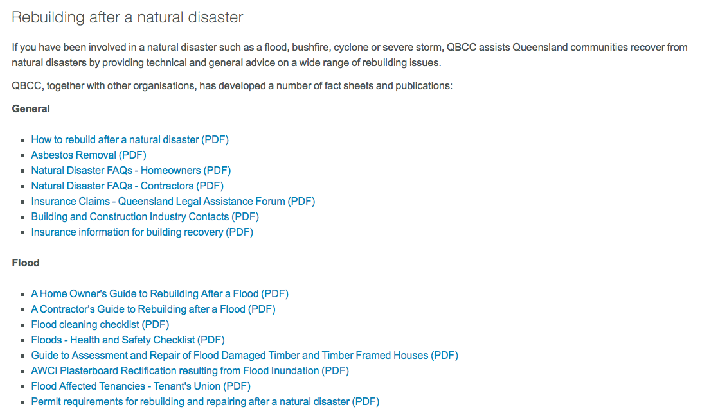](https://www.qbcc.qld.gov.au/home-maintenance/rebuilding-after-natural-disaster)
 
 - Advice - Returning to affected buildings, drinking water, food safety, cleaning up, Managing waste, fallen trees and Insurance claim preparation by [Queensland Goverment](https://www.qld.gov.au/community/disasters-emergencies/recovery-after-disaster/cleaning-up/returning-to-buildings)

Please click image below to visit the official website.
[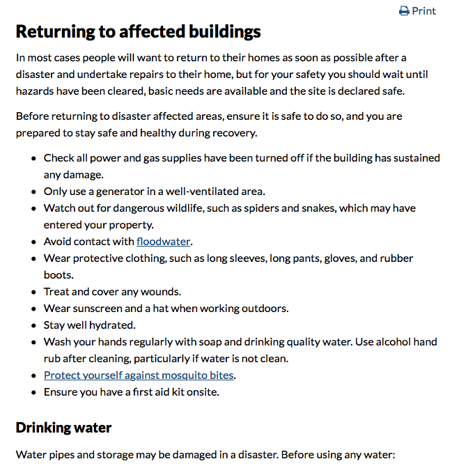](https://www.qld.gov.au/community/disasters-emergencies/recovery-after-disaster/cleaning-up/returning-to-buildings)
 
 ## Local Announcements
 
 - Townsville City Council
 
**February 8th, 2019:** Council rates payment will be delayed

[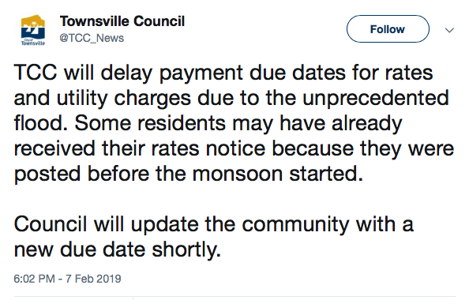](https://twitter.com/TCC_News/status/1093691483905904640)
 
**February 5th, 2019:** Cleaning, garbage and dumping:
 
 "Council provides free dumping to help with flood clean up
Townsville City Council is providing free dumping of domestic waste to help the city clean up and recover from the worst floods in memory." [Source](https://twitter.com/TCC_News/status/1092648570606346241)

"Residents can dump all domestic waste at Council’s facilities free of charge until the end of the unprecedented weather event. 
Townsville Water and Waste Committee Chair Russ Cook said Council has introduced free dumping for the whole community to help the flood clean up." [Source](https://twitter.com/TCC_News/status/1092648621336453120)
 
 - James Cook University
 
 **February 8th, 2019:** Townsville Douglas campus will re-open on Monday 11th February. More info at [jcu website](https://www.jcu.edu.au/news/releases/2019/january/extreme-weather-townsville)
 
 [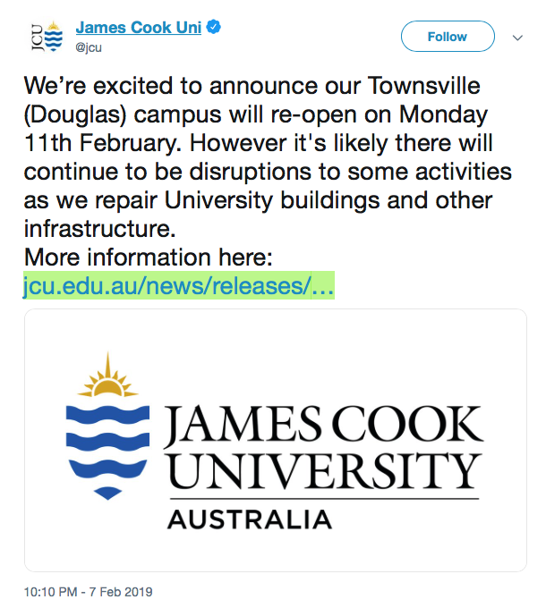](https://twitter.com/jcu/status/1093753921594507264)
 
 **February 6th, 2019:** Update in Townsville campus
 
 "Because of the extreme weather in Townsville, JCU’s Townsville (Douglas) Campus remains partially closed on Wednesday 6th February, Thursday 7th February, and Friday 8th February. Please see below regarding teaching and access to services on Campus. Return to work is occurring for priority services and functions. We are working towards a full opening of the Douglas campus by Monday, 11th February." Source JCU Chief of Staff, for more information visit [JCU website](https://www.jcu.edu.au/news/releases/2019/january/extreme-weather-townsville)
 
 **February 5th, 2019:** Extreme weather and Townsville campus status
 
 "Because of the extreme weather in Townsville, JCU’s Townsville (Douglas) Campus remains partially closed on Wednesday 6th February. No teaching will be occurring on this day, and only essential staff should attend the campus on Wednesday." Information taken from [message](https://twitter.com/jcu/status/1092696092611731456) in the official JCU [twitter account](https://twitter.com/jcu?lang=en). 
 
 More information about JCU courses, and advice to students arriving to the Townsville campus could be found in this [link](https://www.jcu.edu.au/news/releases/2019/january/extreme-weather-townsville).
 
 - State/Catholic/Independent Schools, Early Childhood and Care Services, and TAFE QLD closures
 
 A list of schools and other educational centers closures could be find in the Queensland Department of Education [website](http://closures.det.qld.gov.au)
 
 - Sunbus Townsville
 
 **February 6th, 2019 06:29 AM:** Townsville weather event and latest bus information
 
 Information about school services and public services.
 
[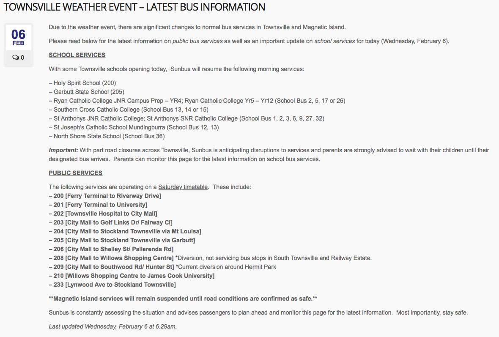](http://www.sunbus.com.au/townsville-weather-event-latest-bus-information/)

[Source](http://www.sunbus.com.au/townsville-weather-event-latest-bus-information/)
 
 ---
 ## How to collaborate or add information in this repo
 
 If you have or find official (or relevant) information that might be pertinent for this repo please share by following one of these steps:
 
 - Please share any relevant information in Twitter and tag [@CexyNature](http://www.twitter.com/CexyNature)
 
 - Please send an email to herrera.ce **at** gmail.com
  
 *Many thanks to those who have sent emails or messages.*
 
 - Please submit a Pull request:
 
    1. Fork this repo to your account
    2. Clone repo to your local machine
    3. Edit, commit and push
    4. Create a Pull request
 
*Some information about submitting pull request can be found in this [article](https://code.tutsplus.com/tutorials/how-to-collaborate-on-github--net-34267)*